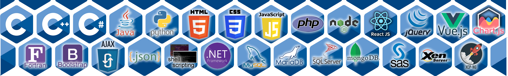

<h1>¡Hola y bienvenido a mi perfil de GitHub!</h1>
# 💫 Sobre mi:
Soy Ernesto, un apasionado desarrollador con 10 años de experiencia en diversos lenguajes de programación. Este espacio es donde comparto mis proyectos, conocimientos y colaboraciones con la comunidad de desarrolladores.

Explora mis repositorios y descubre lo que he estado construyendo. Si te interesa alguno de mis proyectos o tienes alguna pregunta sobre mi experiencia en el desarrollo de software, no dudes en ponerte en contacto conmigo.

Estoy emocionado de compartir ideas, colaborar en proyectos interesantes y aprender junto a otros desarrolladores talentosos. ¡Gracias por visitar mi perfil y espero que encuentres algo que te inspire!

¡Bienvenido de nuevo y espero que disfrutes tu visita!

<h2>🌐</h2> Socials:
 
 
 
 

<h2>💻</h2> Tech Stack:

